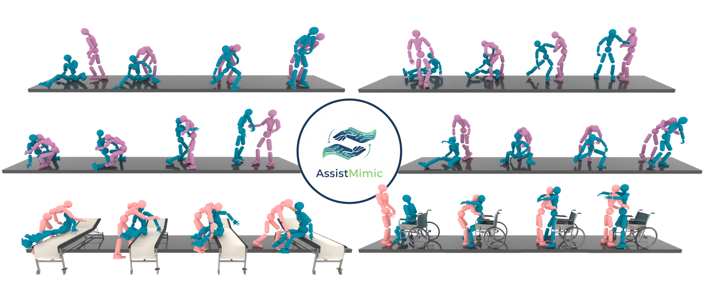

# Learning to Assist: Physics-Grounded Human-Human Control via Multi-Agent Reinforcement Learning [CVPR2026]


Official implementation of CVPR2026 paper: "Learning to Assist: Physics-Grounded Human-Human Control via Multi-Agent Reinforcement Learning". 



## Timeline

- **2026-07-10**: Initial code release.
- **2026-07-17 (planned)**: Large-scale refactoring for improved readability and usability.

# Environment Setup

This project relies on **[PHC (Perpetual Humanoid Control for Real-time Simulated Avatars)](https://github.com/ZhengyiLuo/PHC)** [1].  
Please follow the instructions below to correctly set up the environment and download all required assets.

---

## 1. Install PHC and Prepare Dependencies

Visit the official PHC GitHub repository and complete **Setup Steps 1–4**:

➡️ **PHC Repository:** https://github.com/ZhengyiLuo/PHC

These steps include:

- Creating the appropriate Python environment  
- Installing required Python and system dependencies  
- Downloading the required **SMPL / SMPL-X model files**  
- Downloading PHC sample datasets

Make sure that all four setup steps are completed successfully.

## 2. Download pretrained GMT policy weight
- Download pretraiend weights at : https://drive.google.com/drive/folders/12DFXtGtSjiHdyqru4FzwYfKg3uMPbVWw?usp=drive_link
- Put this folder under **output/**

## 3. Download evaluation checkpoints and sample data
- Download the evaluation checkpoints and motion data at: https://drive.google.com/drive/folders/1-8Wkx6lK8glxzZZG-dkou18Sj1mBk4DU?usp=drive_link
- Put the downloaded folders under the repository root as **checkpoints/** and **sample_data/**

# Evaluate Tracking Policy

Use the provided evaluation scripts to run the full evaluation pipeline.
The evaluation checkpoints (downloaded in Setup step 3) live under `checkpoints/`; the scripts stage them into `output/HumanoidIm/` automatically.

## Inter-X Dataset [2]

```bash
bash scripts/inter-x-run-eval.sh
```

Evaluates AssistMimic and its ablations (Table 2) under three conditions: `normal`, `mass-1.2`, and `weakness-0.25`. The script also runs an extra variant with a tighter retargeting threshold (0.8 instead of 1.3), which is not part of Table 2.

## HHI-Assist Dataset [3]

```bash
bash scripts/hhi-assist-run-eval.sh
```

Evaluates AssistMimic and its ablations (Table 3) under three conditions: `normal`, `mass-1.5`, and `hip-torque-0.5`.

## Evaluation Data

The evaluation motion files (`*_100*.pkl`) are derived from the training motion files as follows:

- **Inter-X** (`interx_processed_fixed_v9_cluster_ids_0_n_clusters_10_100.pkl`): each training motion is duplicated 100 times (keys suffixed `test0`–`test99`). With 1000 parallel environments, this yields 100 trials per motion in a single evaluation pass, so success rates are averaged over 100 rollouts per motion.
- **HHI-Assist** (`hhi-assist_processed_v6_AA-RM-wo-FullAssist_100_short.pkl`): same 100x duplication. In addition, the last 15 frames (0.5 s at 30 fps) of each clip — the segment after the assistance has ended — are trimmed (`_short`).

The motion contents are otherwise identical to the training files.

## Visualize Generalist Policy (30 motions)

Runs the DAgger-distilled generalist policy (a single policy trained on 30 diverse interaction clips) with GUI rendering:

```bash
bash scripts/visualize_policy.sh
```

The script loads `checkpoints/g-cluster_0_1_2_4_n_clusters_10-cvpr2026-dagger-9k-v2/Humanoid.pth` and rolls it out on the 30 motions in `sample_data/interx_processed_fixed_v9_cluster_ids_0_1_2_4_n_clusters_10.pkl`. Set `headless=True` inside the script to run it as a batch evaluation instead.

## Evaluation Parameters

| Parameter | Description |
|-----------|-------------|
| `test=True im_eval=True` | Enable evaluation mode |
| `headless=True` | Run without GUI |
| `epoch=-1` | Load `Humanoid.pth` in the experiment directory |
| `env.num_envs=1000` | Number of parallel environments for evaluation |
| `eval_subdir` | Subdirectory for saving evaluation results (e.g., `normal`, `mass-1.2`) |
| `++env.interx_data_path` | Path to test data (different from training data) |
| `++env.recipient_mass_scale` | Recipient mass scale (default: 0.7) |
| `++env.recipient_weakness_scale` | Recipient stiffness/damping scale (default: 0.5) |
| `rl_device`, `device_id` | GPU device settings |

# Train tracking policy

## Inter-X Dataset
```bash
python assistmimic/run_hydra.py env=env_im_interx_helpup learning=im_simpleliftup_mlp exp_name=g-cluster-1-n10-assistmimic-cvpr2026 test=False headless=True robot=smplx_humanoid robot.freeze_hand=False robot.box_body=False env.interx_data_path="sample_data/interx_processed_fixed_v9_cluster_ids_1_n_clusters_10.pkl"
```

## HHI-Assist Dataset
```bash
python assistmimic/run_hydra.py env=env_im_hhi-assist learning=im_hhi-assist_mlp exp_name=hhi-assist-assistmimic-cvpr2026 test=False headless=True robot=smplx_humanoid robot.freeze_hand=False robot.box_body=False ++env.hhi_assist_bed_data_path="sample_data/hhi-assist_processed_v6_AA-RM-wo-FullAssist.pkl"
```

# Train Generalist Policy (DAgger distillation)

The generalist policy (Table 4) is a single policy distilled online from per-cluster specialist teachers over the 30 combined interaction clips (`interx_processed_fixed_v9_cluster_ids_0_1_2_4_n_clusters_10.pkl`). The student is trained from scratch; at each step the `HumanoidImInterxHelpUpDist` task selects the teacher for the current motion's cluster and supervises the student's actions.

**Prerequisite — the four per-cluster specialist teachers.** The teacher checkpoints are listed in the `teacher_policies` block of `assistmimic/data/cfg/env/env_im_interx_helpup_distill.yaml`, each expected at `output/HumanoidIm/g-cluster-{0,1,2,4}-...`. Train one specialist per cluster with the [specialist training command](#train-tracking-policy) (varying `cluster_ids_{0,1,2,4}`), or edit the block to point at your own checkpoints.

**Distillation.** Once the four teachers are in place, run the single distillation command:

```bash
python assistmimic/run_hydra.py env=env_im_interx_helpup_distill learning=im_helpup_distill \
  exp_name=g-cluster_0_1_2_4_n_clusters_10-cvpr2026-dagger \
  test=False headless=True robot=smplx_humanoid robot.freeze_hand=False robot.box_body=False \
  ++env.interx_data_path=sample_data/interx_processed_fixed_v9_cluster_ids_0_1_2_4_n_clusters_10.pkl
```

To evaluate or visualize the released distilled policy instead of retraining, use `bash scripts/visualize_policy.sh` (see [Visualize Generalist Policy](#visualize-generalist-policy-30-motions)).

---

## Other Training Modes

### Freeze Recipient Mode
Freezes the recipient network and trains only the caregiver network.

```bash
python assistmimic/run_hydra.py \
  env=env_im_hhi-assist \
  learning=im_hhi-assist_mlp \
  exp_name=hhi-assist-freeze-recipient \
  test=False headless=True \
  robot=smplx_humanoid robot.freeze_hand=False robot.box_body=False \
  learning.params.network.freeze_recipient=true
```

---

## Kinematic-Recipient Baseline
Forces the recipient to follow the reference motion kinematically. Used as a single-agent baseline in the paper.

```bash
mkdir -p output/HumanoidIm/g-cluster-0-n10-ours-v14-adj
cp checkpoints/g-cluster-0-n10-ours-v14-adj/Humanoid.pth output/HumanoidIm/g-cluster-0-n10-ours-v14-adj/Humanoid.pth
python assistmimic/run_hydra.py \
  env=env_im_interx_helpup \
  learning=im_simpleliftup_mlp \
  robot=smplx_humanoid robot.freeze_hand=False robot.box_body=False \
  exp_name=g-cluster-0-n10-ours-v14-adj \
  test=True im_eval=True headless=True epoch=-1 \
  ++env.interx_data_path=sample_data/interx_processed_fixed_v9_cluster_ids_0_n_clusters_10_100.pkl \
  ++env.recipient_kinematic_replay=true
```

## Recipient Weakness Parameters

#### Inter-X Dataset

| Parameter | Description | Default |
|-----------|-------------|---------|
| `recipient_mass_scale` | Mass scale factor | 0.7 |
| `recipient_weakness_scale` | Stiffness/damping scale for lower body | 0.5 |
| `recipient_weakness_effort` | Max torque for lower body (hips, knees, ankles, toes) | 80.0 |

```bash
# Evaluation with increased mass (mass-1.2)
python assistmimic/run_hydra.py ... \
  ++env.recipient_mass_scale=0.84 \
  eval_subdir=mass-1.2

# Evaluation with weakened lower body
python assistmimic/run_hydra.py ... \
  ++env.recipient_weakness_scale=0.25 \
  eval_subdir=weakness-0.25
```

#### HHI-Assist Dataset

| Parameter | Description | Default |
|-----------|-------------|---------|
| `recipient_mass_scale` | Mass scale factor | 0.7 |
| `recipient_weakness_scale` | Stiffness/damping scale | 0.5 |
| `recipient_weakness_effort` | Max torque for lower body (knees, ankles, toes) | 80.0 |
| `recipient_hip_effort` | Max torque for hip joints | 20.0 |
| `recipient_upper_body_effort` | Max torque for upper body (torso, chest, spine) | 40.0 |

```bash
# Evaluation with increased mass (mass-1.5)
python assistmimic/run_hydra.py ... \
  ++env.recipient_mass_scale=1.05 \
  eval_subdir=mass-1.5

# Evaluation with weakened hip
python assistmimic/run_hydra.py ... \
  ++env.recipient_hip_effort=10 \
  eval_subdir=hip-torque-0.5
```

## Assistance Stability Evaluation

The following metrics quantify how stably the recipient is supported during assistance (computed for recipients only):

| Metric | Description |
|--------|-------------|
| `max_torque` | Maximum torque applied by the recipient during the episode |
| `com_stability` | Standard deviation of COM position over the episode (3D norm, lower = more stable) |
| `com_stability_xy` | COM stability in the xy plane only |

These metrics are reported separately for all episodes and successful episodes only.

### Fair Policy Comparison (Common Success Intersection)
When comparing COM stability between policies, early-terminated episodes have unfairly low COM variance. Use this script to compute metrics only on motions where ALL policies succeeded:

```bash
python scripts/compare_policies_common_success.py \
    --policies output/HumanoidIm/policy_A \
               output/HumanoidIm/policy_B \
               output/HumanoidIm/policy_C \
    --condition normal
```

Options:
- `--policies`: Paths to 2+ policy directories (must have `evaluation/<condition>/evaluation_results.json`)
- `--condition`: Evaluation condition (`normal`, `mass-1.5`, `hip-torque-0.5`)
- `--all-conditions`: Compare all conditions at once
- `--output`: Save results to JSON file

The script reports:
- Per-policy success rates
- Metrics (max_torque, com_stability, com_stability_xy) computed only on common successful episodes
- Paired t-tests for statistical significance

# References

[1] Zhengyi Luo, Jinkun Cao, Alexander Winkler, Kris Kitani, and Weipeng Xu. "Perpetual Humanoid Control for Real-time Simulated Avatars." IEEE/CVF International Conference on Computer Vision (ICCV), 2023.

[2] Liang Xu, Xintao Lv, Yichao Yan, Xin Jin, Shuwen Wu, Congsheng Xu, Yifan Liu, Yizhou Zhou, Fengyun Rao, Xingdong Sheng, et al. "Inter-X: Towards Versatile Human-Human Interaction Analysis." IEEE/CVF Conference on Computer Vision and Pattern Recognition (CVPR), 2024.

[3] Saeed Saadatnejad, Reyhaneh Hosseininejad, Jose Barreiros, Katherine M Tsui, and Alexandre Alahi. "HHI-Assist: A Dataset and Benchmark of Human-Human Interaction in Physical Assistance Scenario." IEEE Robotics and Automation Letters, 2025.

# Citation

If you find this work useful, please cite:

```bibtex
@inproceedings{shibata2026assistmimic,
  title={Learning to Assist: Physics-Grounded Human-Human Control via Multi-Agent Reinforcement Learning},
  author={Shibata, Yuto and Yamazaki, Kashu and Jayanti, Lalit and Aoki, Yoshimitsu and Isogawa, Mariko and Fragkiadaki, Katerina},
  booktitle={Proceedings of the IEEE/CVF Conference on Computer Vision and Pattern Recognition (CVPR)},
  year={2026}
}
```
